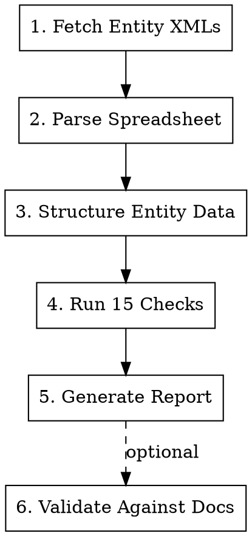

# BPO Analysis Skill

Analyze Salesforce UDD platform entity (BPO) XML definitions against the **Industries Q4 Best Practices and Review Checklist** (15 checks). Produces a consolidated report with themed findings, per-entity details, and prioritized action items.

## Required Inputs

1. **Entity XMLs** — the user provides ANY of these (auto-detect the type):

   | Input | How to read | Example |
   |---|---|---|
   | **Local folder path** | Glob for `*.entity.xml`, then Read each file | `/opt/workspace/core-public/core/my-module-udd/java/resources/udd/my-module-udd/` |
   | **Gitcore folder URL** | `mcp__codesearch__tree` + `mcp__codesearch__blob` | `https://gitcore.soma.salesforce.com/org/repo/-/tree/HEAD/path/to/udd/` |
   | **Single local file** | Read directly | `/path/to/MyEntity.entity.xml` |
   | **Single gitcore URL** | `mcp__codesearch__blob` | `https://gitcore.soma.salesforce.com/org/repo/-/blob/HEAD/path/to/MyEntity.entity.xml` |

2. **Data Model spreadsheet** (optional — needed for Check 4 field alignment):

   | Input | How to read |
   |---|---|
   | **Local `.xlsx`** | `mcp__aisuite__python` with zipfile (Read tool can't handle binary) |
   | **Google Sheets URL** | `mcp__google__docs_get` with the file ID |

If entity XMLs are not provided, ask the user. If spreadsheet is not provided, skip Check 4 (mark as N/A).

## Workflow



### Step 1: Fetch Entity XMLs

**Auto-detect input type from what the user provides:**

| If input... | Type | How to read |
|---|---|---|
| Starts with `http://` or `https://` and contains `/-/tree/` | Gitcore folder | `mcp__codesearch__tree` + `mcp__codesearch__blob` |
| Starts with `http://` or `https://` and contains `/-/blob/` | Gitcore single file | `mcp__codesearch__blob` |
| Starts with `/` or `~` and ends with `/` or is a directory | Local folder | Glob for `*.entity.xml` + Read each |
| Starts with `/` or `~` and ends with `.entity.xml` | Local single file | Read directly |
| Looks like a gitcore repo path but not a full URL (e.g., `gitcore.soma.salesforce.com/org/repo/...`) | Gitcore — missing scheme | Prepend `https://`, then use codesearch as above |

**Gitcore folder:**
1. `mcp__codesearch__tree` to list the folder
2. `mcp__codesearch__blob` for each entity file (parallelize — batch all in one round)
3. Parse URL: extract `{code_host}`, `{org}`, `{repo}`; use `HEAD` as ref when no branch specified

**Local folder:**
1. Glob for `**/*.entity.xml` in the given directory
2. Read each matching file directly

**Single file** (local or gitcore):
- Read or fetch directly — analyze as a single-entity report

**Filter rules — include only:**
- Files matching `*.entity.xml`

**Skip:**
- `*ChangeEvent*.entity.xml` (concreteAssociateEntity, not standard BPO)
- `module.xml`
- `*.settings.xml`
- `*.accessChecks.xml`

### Step 2: Parse Data Model Spreadsheet

**Google Sheets:** Use `mcp__google__docs_get` with the file ID.

**Local `.xlsx`:** Use `mcp__aisuite__python` with zipfile + xml.etree parsing. The Read tool cannot handle binary xlsx.

**Key:** Detect header row columns dynamically per sheet — column positions for Field Developer Name, Data Type, and Reference Entity vary by sheet. Build a sheet-name-to-entity mapping from the workbook.

### Step 3: Structure Entity Data

For each entity XML, extract:

| Category | Fields to Extract |
|---|---|
| **Entity attributes** | entityName, entityType, keyPrefix, owner, minApiVersion, isTopLevel |
| **Flex fields** | slot, fieldName, columnType/fieldType, domain, foreignKeyConstraint, maxLength, isMultiLookup, isDerived |
| **Flex indexes** | indexNum, field1/field2/field3, unique, caseSensitive, plsqlName |
| **Relationships** | All MASTERDETAIL, FOREIGNKEY, LOOKUP fields with their slot, domain, constraint |
| **Other** | defaultFilterColumns, nameField type (AutoNumber vs Text) |

**Important:** Derived fields (`isDerived="true"`) have no slot number — exclude them from slot gap analysis but note them for field alignment (Check 4).

### Step 4: Run 15 Checks Programmatically

Use `mcp__aisuite__python` to run all checks systematically. See [references/bpo-checklist.md](references/bpo-checklist.md) for the full check definitions, pass/fail criteria, and technical constants.

**Summary of checks:**

| # | Check | Scope |
|---|---|---|
| 1 | Slot0 MasterDetail | Per-entity |
| 2 | Slot0 Index Candidate | Per-entity |
| 3 | No Text on Slot0 | Per-entity |
| 4 | Field Alignment | Per-entity + spreadsheet |
| 5 | Flex Index Definitions | Per-entity |
| 6 | FK Constraints | Per-entity |
| 7 | Flex Index Number Ranges | Per-entity |
| 8 | Text Case Sensitivity | Per-entity |
| 9 | Unique Text with Flex Index | Per-entity |
| 10 | Save Hook SOQL in Loops | Per-entity (Java) |
| 11 | Row Lock Contention | Per-entity |
| 12 | Slot Utilization | Per-entity |
| 13 | Duplicate Index Detection | Per-entity |
| 14 | Relationship Field Index Coverage | Per-entity |
| 15 | Cascade Delete Depth | **Cross-entity** |

Check 15 requires building a MASTERDETAIL parent-child graph across ALL entities, then tracing chains from leaf nodes to find max depth.

### Step 5: Generate Report

See [references/report-templates.md](references/report-templates.md) for the full output format.

**Report structure:**
1. **Header** — date, source, module, API version, checklist version
2. **Consolidated summary table** — Entity x PASS/FAIL/WARN/N/A counts
3. **Critical failures grouped by theme** — each with a "Why this matters" explainer
4. **Warnings grouped by theme** — same format
5. **Cross-entity analysis** — cascade chains table
6. **Detailed per-entity reports** — field tables + per-check status/details
7. **Consolidated action items** — High/Medium/Low priority tables

**Theming rules:** Group findings by pattern (e.g., "Text on Slot 0", "Missing Flex Indexes on FK Fields"), not just per-entity. Each theme needs a "Why this matters" paragraph explaining the performance or correctness impact.

### Step 6: Validate Against Design Docs (Optional)

When the user provides architecture/design documents:

1. Use Explore subagents to analyze docs in parallel
2. Cross-validate each FAIL/WARN against documented data volumes, query patterns, and SLAs
3. Classify findings: **Confirmed Critical** / **Partially Justified** / **Acceptable**
4. Output a separate validation report with **P0-P3** priorities and evidence citations

## Technical Constants

```
TEXT_TYPES = {STRING, STRINGPLUSCLOB, TEXTAREA, LONGTEXTAREA, RICHTEXTAREA,
              TEXT, MULTILINETEXT, HTMLSTRINGPLUSCLOB}

RESERVED_INDEX_RANGES:
  -1          = Alternate key (unique constraint)
  -15 to -20  = CreatedDate indexes
  -21 to -26  = CreatedBy indexes
  -28 to -30  = Formula-based indexes
```

## MCP Dependencies

For **local files** (folder path or single XML), no MCP is needed — use Glob + Read directly.

For **remote sources**:
- **`mcp__codesearch`** — for fetching entity XMLs from gitcore. Must be connected in AI Suite settings. If "Not connected" error occurs, the user must reconnect manually.
- **`mcp__google__docs_get`** — only if spreadsheet is a Google Sheets URL.

For **programmatic checks and xlsx parsing**:
- **`mcp__aisuite__python`** — for running checks programmatically and parsing binary `.xlsx` files.

## Common Pitfalls

| Issue | Solution |
|---|---|
| xlsx files are binary | Use `mcp__aisuite__python` with zipfile — Read tool fails on binary |
| Spreadsheet sheets have different column layouts | Detect header columns dynamically per sheet |
| ChangeEvent entities in the folder | Skip — they are concreteAssociateEntity, not standard BPO |
| Derived fields have no slot | Exclude from slot gap analysis (Check 12) |
| codesearch MCP disconnects mid-session | User must reconnect in AI Suite settings |
| Check 15 needs all entities | Build MD graph across full entity set before tracing |