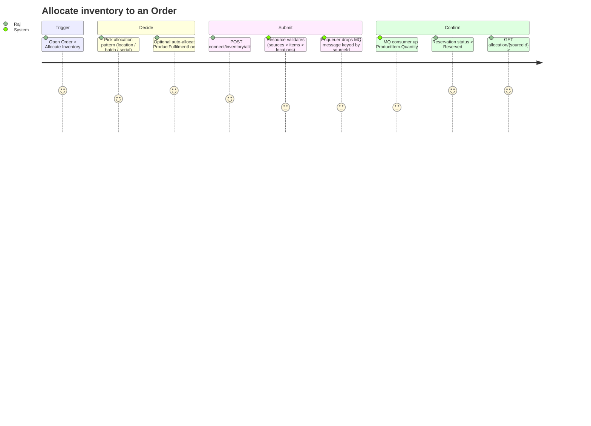

# Manufacturing Cloud Inventory States and Allocation

Inventory Allocation provides a mechanism for soft-reserving inventory for various types of demand (sales orders, work orders, etc.), ensuring accurate tracking of available, on-hand, and allocated stock. The system is decoupled from order types, built around dedicated reservation entities, and designed for high-volume concurrent transactions.

## Design Principles

- **Decoupling**: Allocation logic is decoupled from consuming systems (Sales Orders, Work Orders) — APIs are order-type agnostic
- **Scalability**: Async processing via Message Queue handles high-volume concurrent allocations
- **Supported product types** (current implementation):
  - ✅ Standard products (non-batched, non-serialized) — Pattern 1 below
  - ✅ Unbatched serialized products — Pattern 2 below
  - ❌ Batched products (any kind) — **explicitly rejected**. `InventoryAllocationResourceImpl#validateBatchedProduct(...)` calls `InventoryAllocationValidationUtil.listBatchedProducts(productIds)`; if any line-item product is batched, the request fails with the `CONTAINS_BATCHED_PRODUCT` error label.
  - ❌ Serialized products that live inside a batch — same rejection (the line item product is itself batched)
- **No validation on available qty**: The system does not block allocations when available quantity is insufficient (out of scope for initial release)

## Licensing & Access

| Requirement | Value |
|-------------|-------|
| Org perm | `InventoryAllocation` |
| Org preference | `InventoryAllocationEnabled` |
| Platform license | Inventory Allocation (`InventoryAllocation`) |
| User perm | `ManageInventoryAllocation` |
| User license | Inventory Allocation User (`InvAllocationUserPsl`) |
| Setup page | Inventory Allocation Settings |
| Access checks | `orgHasInventoryAllocationEnabled`, `userHasAccessToInventoryAllocation` |

## Key Objects

| Object | API Name | Purpose |
|--------|----------|---------|
| Product Item | `ProductItem` | Inventory stock at a location (QtyOnHand, QtyAllocated, QtyDamaged, QtyAvailable) |
| Inventory Reservation | `InventoryReservation` | Header — links to source (Order/WorkOrder/ReturnOrder) via polymorphic FK |
| Inventory Item Reservation | `InventoryItemReservation` | Line-level reservation per product + location |
| Inventory Batch Item Reservation | `InventoryBatchItemReservation` | Batch-level reservation (child of InventoryItemReservation) |
| Inventory Serialized Product Reservation | `InventorySerializedProductReservation` | Instance-level reservation for serialized products |
| Inventory Item Instance Reservation | `InventoryItemInstanceReservation` | 262 enhanced instance reservation (child of InventoryBatchItemReservation) |
| Product Item Additional Transaction | `ProductItemAdditionalTransaction` | Transaction log for all quantity state changes |
| Product Batch Item | `ProductBatchItem` | Inventory at batch level (ProductItem + ProductionBatch) |
| Serialized Product | `SerializedProduct` | Individual tracked product instance with AllocationStatus |
| Product Fulfilment Location | `ProductFulfilmentLocation` | Mapping of product to fulfillment location (for auto-allocation) |

## Entity Relationships (ERD)

```
Order / WorkOrder / ReturnOrder
  └── InventoryReservation (ReservationSource = poly FK to Order)
        └── InventoryItemReservation (per product + location)
              ├── InventoryBatchItemReservation (per batch, master-detail)
              │     └── InventoryItemInstanceReservation (per serialized product)
              └── InventorySerializedProductReservation (unbatched serialized)

ProductItem (ProductId + LocationId)
  ├── QtyOnHand, QtyAllocated, QtyDamaged, QtyInTransit, QtyOrdered
  ├── QtyAvailable = formula(QtyOnHand - QtyAllocated - QtyDamaged)
  ├── QtyStateRefreshDate
  └── ProductItemAdditionalTransaction (transaction log)

ProductBatchItem (ProductId + LocationId + ProductionBatch)
  ├── RemainingQuantity, QtyAllocated, QtyAvailable (formula)
  └── QtyStateRefreshDate

SerializedProduct
  ├── Status: [Available, Sent, Consumed, Damaged, Lost]
  └── AllocationStatus: [None, Allocated, Deallocated]
```

## Reservation Status Transitions

```
[API]  → Reservation In Progress
         → [System] Reserved
              → [API] Cancellation In Progress
                   → [System] Cancelled
```

- **Reservation In Progress**: Created by allocation API, pending async processing
- **Reserved**: System confirms after MQ processing updates ProductItem quantities
- **Cancellation In Progress**: Created by deallocation API
- **Cancelled**: System confirms after MQ processing reverses quantities

## APIs

### 1. Allocation API

**`POST connect/inventory/allocation`**

Supports 4 allocation patterns in a single request:

#### Pattern 1: Location-Level (v260 — standard products)
Allocates inventory directly at the location level. No batch or serialized info.
```json
{
  "allocationData": [{
    "sourceId": "<OrderId>",
    "items": [{
      "sourceItemId": "<OrderItemId>",
      "allocations": [{
        "sourceLocationId": "<LocationId>",
        "allocatedQuantity": 75
      }]
    }]
  }]
}
```
**Creates:** InventoryReservation → InventoryItemReservation

#### Pattern 2: Batch-Level (non-serialized)
Allocates by batch within a location.
```json
{
  "allocations": [{
    "sourceLocationId": "<LocationId>",
    "allocatedQuantity": 30,
    "batches": [
      { "batchItemId": "<ProductBatchItemId>", "quantity": 10 },
      { "batchItemId": "<ProductBatchItemId>", "quantity": 20 }
    ]
  }]
}
```
**Creates:** InventoryItemReservation → N x InventoryBatchItemReservation

#### Pattern 3: Serialized Product — Batch Allocation
Allocates specific serialized products within a batch.
```json
{
  "allocations": [{
    "sourceLocationId": "<LocationId>",
    "allocatedQuantity": 2,
    "batches": [{
      "batchItemId": "<ProductBatchItemId>",
      "quantity": 2,
      "batchedSerializedProductIds": ["<SP-1>", "<SP-2>"]
    }]
  }]
}
```
**Creates:** InventoryItemReservation → InventoryBatchItemReservation → N x InventorySerializedProductReservation

#### Pattern 4: Serialized Product — Non-Batch Allocation
Allocates serialized products not associated with any batch.
```json
{
  "allocations": [{
    "sourceLocationId": "<LocationId>",
    "allocatedQuantity": 2,
    "unbatchedSerializedProductIds": ["<SP-4>", "<SP-6>"]
  }]
}
```
**Creates:** InventoryItemReservation → N x InventorySerializedProductReservation

### 2. Deallocation API

**`POST connect/inventory/deallocation`**

Supports 5 deallocation patterns:

| Level | Scope | Required Fields |
|-------|-------|-----------------|
| Item-level | Deallocate ALL reservations for a line item | `sourceItemId` only |
| Location-level | Deallocate at specific locations | + `sourceLocationIds[]` |
| Batch-level (non-serialized) | Deallocate specific batches | + `batchItemIds[]` |
| Batch-level (serialized) | Deallocate serialized products in a batch | + `batchItemIds[]` + `serializedProductIds[]` |
| Serialized (unbatched) | Deallocate unbatched serialized products | + `serializedProductIds[]` |

**Deallocation behavior:**
- Sets matching reservation records to `Cancellation In Progress` → `Cancelled`
- Child reservations (batch-level, serialized-level) are cancelled based on request specificity
- SerializedProduct.AllocationStatus → `Deallocated`
- QtyAllocated decremented on ProductItem / ProductBatchItem after async processing

### 3. Get Allocation API

**`GET connect/inventory/allocation/{orderId}?pageNumber=1&pageSize=10`**

Returns allocation summary per line item with status:
- `NOT_ALLOCATED` / `PARTIALLY_ALLOCATED` / `FULLY_ALLOCATED`

Response includes:
- `totalRequiredQuantity` — line item quantity
- `totalRequestedAllocationQty` — total allocation requested
- `quantityAllocationPending` — sum of pending transactions
- `quantityAllocationCompleted` — sum of successful transactions
- `requestedAllocations[]` — what was requested per location
- `allocations[]` — what was actually reserved per location

For 262, the response also includes `batchReservations[]` and `instanceReservations[]`.

## Async Processing Architecture

```
Allocation API
  → Create InventoryItemReservation (status: Reservation In Progress)
  → Create ProductItemAdditionalTransaction (status: Pending)
  → Publish MQ message with impacted ProductItem IDs

MQ Handler (Inventory Processing Layer)
  → Acquire lock on ProductItem(s)
  → If locked: re-enqueue with 15s delay (max 3 retries, then fallback to manual sync)
  → Aggregate all Pending transactions for the ProductItem
  → Update ProductItem.QtyAllocated
  → Set transaction status = Success/Failure
  → Set reservation status = Reserved
  → Send in-app notification
```

## Auto Allocation

**Pre-requisite:** Create `ProductFulfilmentLocation` records mapping each product to its desired fulfillment location.

**Behavior:**
- UI-only action (no dedicated API yet)
- Uses ProductFulfilmentLocation data to auto-fill allocation preview
- User can review, edit, and save before committing

## Test Data Creation Patterns

### Foundation Data (Required for ALL tests)
```
Product2 → Location → ProductItem (QtyOnHand > 0)
Account → Order → OrderItem (per product line)
```

### Pattern A: Standard Product Allocation
```
Product2: "Generator" (non-serialized, non-batched)
Locations: "Chennai", "Surat"
ProductItem(Generator, Chennai): QtyOnHand=200
ProductItem(Generator, Surat): QtyOnHand=100
Order → OrderItem(Generator, qty=98)
→ Call allocation API with multi-location split
→ Verify: 2x InventoryItemReservation, QtyAllocated updated
```

### Pattern B: Batch-Level Allocation
```
Product2: "Motor" (batched, non-serialized)
Location: "Bangalore"
ProductionBatch: BATCH-001, BATCH-002
ProductBatchItem(Motor, Bangalore, BATCH-001): RemainingQty=100
ProductBatchItem(Motor, Bangalore, BATCH-002): RemainingQty=50
Order → OrderItem(Motor, qty=30)
→ Call allocation API with batches array
→ Verify: InventoryBatchItemReservation per batch, QtyAllocated on ProductBatchItem
```

### Pattern C: Serialized + Batch Allocation
```
Product2: "Circuit" (serialized, batched)
Location: "Bangalore"
ProductionBatch: PB-1
ProductBatchItem(Circuit, Bangalore, PB-1): RemainingQty=10
SerializedProduct: SP-1 (Status=Available, AllocationStatus=None, Batch=PB-1)
SerializedProduct: SP-2 (Status=Available, AllocationStatus=None, Batch=PB-1)
Order → OrderItem(Circuit, qty=2)
→ Call allocation API with batchedSerializedProductIds
→ Verify: InventorySerializedProductReservation, SP.AllocationStatus=Allocated
```

### Pattern D: Serialized Non-Batch Allocation
```
Product2: "iPhone" (serialized, no batch)
Location: "Hyderabad"
SerializedProduct: SP-4 (Status=Available, AllocationStatus=None, no batch)
SerializedProduct: SP-6 (Status=Available, AllocationStatus=None, no batch)
Order → OrderItem(iPhone, qty=2)
→ Call allocation API with unbatchedSerializedProductIds
→ Verify: InventorySerializedProductReservation, SP.AllocationStatus=Allocated
```

### Pattern E: Mixed Composite Request
Combine patterns A-D in a single API call with multiple items array.

### Pattern F: Deallocation after Allocation
Run any allocation pattern, then call deallocation API. Verify:
- Reservation status → Cancelled
- QtyAllocated decremented
- SerializedProduct.AllocationStatus → Deallocated (for serialized)

### Pattern G: Auto Allocation
```
ProductFulfilmentLocation records mapping products to locations
Order with multiple line items
→ Trigger auto-allocate from UI
→ Verify allocations match ProductFulfilmentLocation mapping
```

## Key Test Scenarios

| Category | Scenario |
|----------|----------|
| **Happy path** | Full allocation, partial allocation, multi-location split |
| **Status transitions** | ReservationInProgress → Reserved → CancellationInProgress → Cancelled |
| **Quantity math** | QtyAllocated incremented/decremented correctly on ProductItem and ProductBatchItem |
| **Serialized status** | AllocationStatus transitions: None → Allocated → Deallocated |
| **Async processing** | Transaction log records in ProductItemAdditionalTransaction (Pending → Success) |
| **Concurrency** | Two allocations targeting same ProductItem — lock/re-enqueue behavior |
| **Edge cases** | Allocate > QtyOnHand (warning, not blocked), already-allocated SP, invalid IDs |
| **Pagination** | Get Allocation API with pageNumber/pageSize, hasNext |
| **Backward compat** | v260 payload structure still works in v262 |

## Troubleshooting

| Issue | Likely Cause | Fix |
|-------|-------------|-----|
| API returns 403 | Missing `ManageInventoryAllocation` perm or org pref disabled | Enable org pref + assign user perm |
| Allocation stuck in "Reservation In Progress" | MQ handler failed or lock contention | Check ProductItemAdditionalTransaction status; may need manual sync |
| QtyAllocated not updating | Async processing delayed under high volume | Check QtyStateRefreshDate; review transaction logs |
| SerializedProduct can't be allocated | AllocationStatus already "Allocated" or Status not "Available" | Deallocate first or check product status |
| Deallocation not reflecting | Cancellation still in progress | Wait for async processing; check transaction logs |
| Auto-allocate shows no preview | Missing ProductFulfilmentLocation records | Create mapping records for products |

## SOQL Quick Reference

```sql
-- Product items with allocated inventory
SELECT Id, Product2Id, Product2.Name, LocationId, Location.Name,
       QuantityOnHand, QuantityAllocated, QuantityAvailable, QuantityDamaged,
       QuantityStateRefreshDate
FROM ProductItem
WHERE QuantityAllocated > 0
ORDER BY Product2.Name

-- Inventory reservations for an order
SELECT Id, ReservationSource, UsageType, AsyncOperationInProgress
FROM InventoryReservation
WHERE ReservationSource = '<OrderId>'

-- Item reservations with status
SELECT Id, Product, ReservedAtLocation, Quantity, Status,
       ProductItem, ReservationDate, IsAutoReserved
FROM InventoryItemReservation
WHERE InventoryReservation.ReservationSource = '<OrderId>'

-- Batch-level reservations
SELECT Id, ProductBatchItem, Quantity, Status, ReservationDate, IsAutoReserved
FROM InventoryBatchItemReservation
WHERE InventoryItemReservation.InventoryReservation.ReservationSource = '<OrderId>'

-- Serialized product reservations
SELECT Id, SerializedProduct, Status, ReservationDate, IsAutoReserved
FROM InventorySerializedProductReservation
WHERE InventoryItemReservation.InventoryReservation.ReservationSource = '<OrderId>'

-- Pending transactions (async processing backlog)
SELECT Id, ProductItem, TransactionType, RelatedEntity, ProductItemState,
       Quantity, TransactionStatus, TransactionStatusMessage, TransactionDate
FROM ProductItemAdditionalTransaction
WHERE TransactionStatus = 'Pending'
ORDER BY TransactionDate ASC

-- Serialized products with allocation status
SELECT Id, Name, SerialNumber, Status, AllocationStatus, ProductItem, ProductionBatch
FROM SerializedProduct
WHERE AllocationStatus = 'Allocated'

-- Product batch items with allocation info
SELECT Id, ProductId, LocationId, ProductionBatch, RemainingQuantity,
       QuantityAllocated, QuantityAvailable, QtyStateRefreshDate
FROM ProductBatchItem
WHERE QuantityAllocated > 0

-- Product fulfilment location mappings (for auto-allocation)
SELECT Id, Product2Id, Product2.Name, LocationId, Location.Name
FROM ProductFulfilmentLocation
ORDER BY Product2.Name
```

## Customer User Journey — Allocation & Deallocation

Use this section when answering customer-facing "how does it work" / "walk me through it" / "why is X happening" questions. Lead with the click, then the system step it triggers.

### Personas
| Persona | Role | Typical questions |
|---------|------|-------------------|
| **Priya — Inventory Manager** | Owns plant/warehouse stock | "Why isn't QtyAvailable changing?" "What's reserved at my location?" |
| **Raj — Order Fulfillment Specialist** | Promises delivery against orders | "How do I split an order across two locations?" "Pick which serials?" |
| **Sara — Service Dispatcher** | Plans field-service Work Orders | "Reserve a serial part for a tech without removing it from stock?" |
| **Anita — Manufacturing Admin** | Configures the org | "What perm does my team need?" "How do I turn this on?" |

**Pre-conditions Anita owns:** org perm `InventoryAllocation`, org pref `InventoryAllocationEnabled`, user perm `ManageInventoryAllocation` + licence `InvAllocationUserPsl`, seeded `ProductItem` rows, optional `ProductFulfilmentLocation` for auto-allocate. A 403 on Allocate is almost always one of these missing.

### Endpoints customers will hit
| Action | Method + URL | Java handler |
|--------|--------------|--------------|
| Allocate | `POST /services/data/vXX.0/connect/inventory/allocation` | `InventoryAllocationResourceImpl#post` |
| Deallocate | `POST /services/data/vXX.0/connect/inventory/deallocation` | `InventoryDeallocationResourceImpl#post` |
| Read status | `GET /services/data/vXX.0/connect/inventory/allocation/{sourceId}` | `GetInventoryAllocationResourceImpl#get` |

`{sourceId}` = `OrderId` / `WorkOrderId` / `ReturnOrderId` — the system derives the type via `InventoryAllocationFactory.getInventoryAllocationClass(sourceId)`.

### Allocation journey


Step-by-step:
1. **Trigger** — customer opens the Order/WorkOrder/ReturnOrder, clicks **Allocate Inventory**.
2. **Decide pattern** — one of *standard / batch / serial-in-batch / serial-unbatched*. Auto-allocate requires `ProductFulfilmentLocation`.
3. **Submit** — UI calls `POST connect/inventory/allocation`. Resource runs three-stage fail-fast validation:
   - `validateAllSources(...)` — empty / duplicate `sourceId`
   - `validateAllItems(...)` — empty / duplicate `sourceItemId`, items must exist
   - per-source location/batch/serial validation
   - Short-circuits with `ALLOCATION_ALREADY_IN_PROGRESS` if `inventoryItemReservationService.hasInProgressReservationsBySourceIds(...)` is true.
4. **Enqueue** — `InventoryAllocationEnqueuer.enqueue(ALLOCATION, list)` writes one MQ message **per `sourceId`** (deduped: `DuplicateMessageException` is caught and warned).
5. **Async commit** — MQ consumer locks `ProductItem`(s) (re-enqueues with delay on contention), aggregates `ProductItemAdditionalTransaction` rows (`Pending` → `Success`), updates `QuantityAllocated`, flips reservation `Reservation In Progress` → **`Reserved`**, sets `SerializedProduct.AllocationStatus` `None` → **`Allocated`**, sends in-app notification.
6. **Verify** — `GET connect/inventory/allocation/{sourceId}` → status `NOT_ALLOCATED` / `PARTIALLY_ALLOCATED` / `FULLY_ALLOCATED` (`FULLY_ALLOCATED` set when `requestedLineItemQuantity.equals(successfulAllocatedQuantity)`).

### Deallocation journey
```mermaid
journey
    title Deallocate inventory
    section Trigger
      Order cancelled / wrong serial / line reduced: 2: Raj
    section Scope
      Pick scope (item / location / batch / serial): 4: Raj
    section Submit
      POST connect/inventory/deallocation: 4: Raj
      Resource validates (3 stages): 3: System
      Enqueuer drops MQ message: 3: System
    section Confirm
      Reservation > Cancellation In Progress > Cancelled: 5: Raj
      QtyAllocated decremented; SerializedProduct > Deallocated: 5: Priya
```

Five scopes (pick the narrowest one — these mirror the patterns in the API section above):

| Scope | When | What gets cancelled |
|-------|------|---------------------|
| Item-level | Cancel everything for a line | All locations for the line (`productItemId` left null) |
| Location-level | Drop a specific location's reservation | Named locations only |
| Batch (non-serial) | Drop specific batches | Named batches |
| Batch (serialized) | Drop specific serials within a batch | Named serials only |
| Serialized unbatched | Drop unbatched serials | Named serials only |

### Reservation status — use these names verbatim
```
Allocation:   [API] → Reservation In Progress → [System async] Reserved
Deallocation: [API] → Cancellation In Progress → [System async] Cancelled

SerializedProduct.AllocationStatus:
  None ──allocate──▶ Allocated ──deallocate──▶ Deallocated ──allocate again──▶ Allocated
```
A serial in `Allocated` cannot be re-allocated; deallocate first.

### Persona-led FAQ
- **"Is allocation synchronous?"** No. The API returns after validation + enqueue. Quantity updates and final `Reserved` status happen async via the MQ consumer.
- **"Can I allocate more than I have on hand?"** Yes — the system warns but does not block. `QuantityAvailable` can go negative. Layer a custom validation if a hard guard is needed.
- **"How do I deallocate just one serial?"** Send a request scoped to that serial — `deallocations[].serializedProductIds[]` (unbatched) or `batchItemIds[] + serializedProductIds[]` (batched). Other serials stay `Allocated`.
- **"Can two users allocate the same `ProductItem` at once?"** Yes. The MQ consumer locks per message; if locked, re-enqueues with delay (max 3 retries before fallback to manual sync).
- **"How do I retry a stuck allocation?"** Check `ProductItemAdditionalTransaction.TransactionStatus`. Don't re-POST while the reservation is `Reservation In Progress` — you'll hit `ALLOCATION_ALREADY_IN_PROGRESS`.
- **"Difference between `Reservation In Progress` and `Reserved`?"** `In Progress` = API accepted, async work pending. `Reserved` = MQ consumer finished, `QuantityAllocated` updated. `Reserved` is the authoritative committed state.
- **"Does deallocate throw away data?"** No. Reservation rows stay in `Cancelled` for audit; serial flips to `Deallocated`.

### Symptom-based troubleshooting (work backwards from what the customer sees)
| Customer says… | Most likely cause | What to check |
|----------------|------------------|----------------|
| "403 when I click Allocate" | Missing `ManageInventoryAllocation` perm or `InventoryAllocationEnabled` org pref off | `PermissionSetAssignment`; org pref |
| "Allocation already in progress" | Earlier MQ run hasn't finished | SOQL `InventoryItemReservation.Status` for that `sourceId` |
| "Stuck in Reservation In Progress" | MQ consumer hasn't run / lock contention exhausted | `ProductItemAdditionalTransaction.TransactionStatus` + `QuantityStateRefreshDate` lag |
| "Deallocated but `QtyAvailable` didn't change" | Async hasn't finished, or scope was too narrow | Re-check status; verify scope |
| "Can't deallocate this serial — no record" | Resource throws `DEALLOCATION_RECORD_NOT_FOUND_FOR_LOCATION_USER_EXCEPTION` | Confirm serial is `Allocated` and tied to that location |
| "Submitting twice did nothing" | MQ dedupe by `sourceId` (`DuplicateMessageException` caught) | Expected — first submit is in flight |
| "Auto-allocate doesn't pre-fill" | `ProductFulfilmentLocation` missing | Anita seeds the mapping |
| "QtyAvailable went negative" | System does not block over-allocation by design | Layer a custom validation |

### Telemetry & log breadcrumbs (for support escalations)
| Symptom | What to grep |
|---------|-------------|
| API hit but no record | `InventoryAllocationResourceApi-Init` / `InventoryDeallocationResourceApi-Init` |
| API succeeded? | events `ALLOCATION_API_SUCCESS` / `_ERROR`, `DEALLOCATION_API_SUCCESS` / `_ERROR` |
| MQ message went out? | `InventoryAllocationEnqueue-Complete` / `-Failed` and `Single Message enqueued successfully - sourceId: …, messageId: …` |
| Dedupe hit | `DuplicateMessageException` warning in enqueuer log |
| Consumer slow | `ProductItemAdditionalTransaction` `Pending` count + `QuantityStateRefreshDate` lag |

### Code references (for handoff to engineering)
| Concern | File |
|---------|------|
| Allocation API handler | `industries-unified-inventory-connect-impl/.../resource/InventoryAllocationResourceImpl.java` |
| Deallocation API handler | `industries-unified-inventory-connect-impl/.../resource/InventoryDeallocationResourceImpl.java` |
| GET allocation handler | `industries-unified-inventory-connect-impl/.../resource/GetInventoryAllocationResourceImpl.java` |
| Validation utils | `industries-unified-inventory-connect-impl/.../util/InventoryAllocationValidationUtil.java` |
| Allocation factory (resolves source type) | `industries-unified-inventory-impl/.../helper/InventoryAllocationFactory.java` |
| MQ enqueuer | `industries-unified-inventory-impl/.../mq/enqueuer/InventoryAllocationEnqueuer.java` |
| Allocation service (status calc, get-allocation) | `industries-unified-inventory-impl/.../inventoryallocation/service/InventoryAllocationService.java` |
| Status enum constants | `industries-unified-inventory-connect-api/.../util/UnifiedInventoryConnectApiConstants.java` |
| OpenAPI | `industries-unified-inventory-connect-api/java/resources/unified-inventory-api.yaml` |
| FIT functional tests | `industries-unified-inventory-connect-impl/test/func/java/src/inventoryallocation/Base*ResourceApiTest.java` |

> 📖 Source: Manufacturing Cloud — Inventory Allocation
